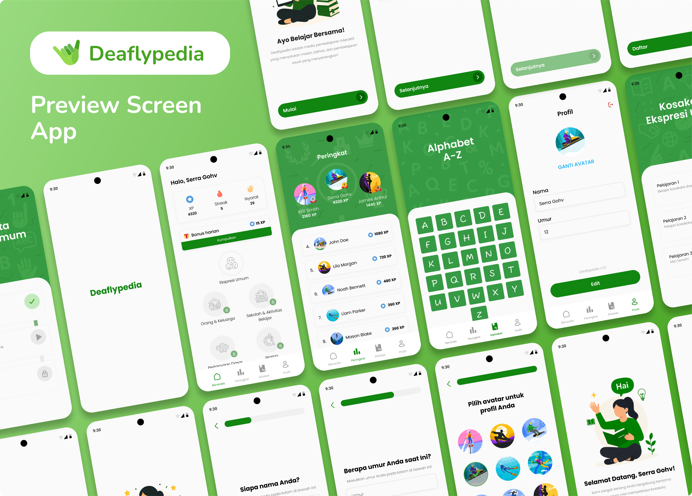

# Deaflypedia App

Welcome to **Deaflypedia**! 🎉  

Deaflypedia is a sign language vocabulary learning app designed for elementary school students with hearing impairments. With a simple and interactive interface, it helps children learn daily vocabulary in a fun and engaging way.

## Step-by-Step Installation

### **Step 1: Download the Project**
Download the project by either:
- **Cloning** the repository, or
- **Downloading** it as a ZIP file.

### **Step 2: Build Error Fix - Gradle Not Found**
If you encounter an error saying that the build.gradle file is not found, follow these steps:
  1. Navigate to the `android/` directory of the project.
  2. Delete the `gradle.properties` file.
  3. Run the following commands in your terminal:
     - `flutter clean`
     - `flutter pub get`

### **Step 3: Launch the Application**
- After following the above steps, you should be able to build and run the project successfully.

## 💡 About the App
- 📖 Sign language vocabulary learning tool  
- 🖐️ Specially designed for children with hearing impairments  
- 🎨 Kid-friendly and interactive interface  
- ⚡ Easy to use and lightweight application  

## Need Help?
If you have any questions or run into any issues, feel free to reach out to me directly at:

**Email:** `wahyukaprawi123@gmail.com`

This guide should help you get started with the project easily. Happy coding! 🚀
